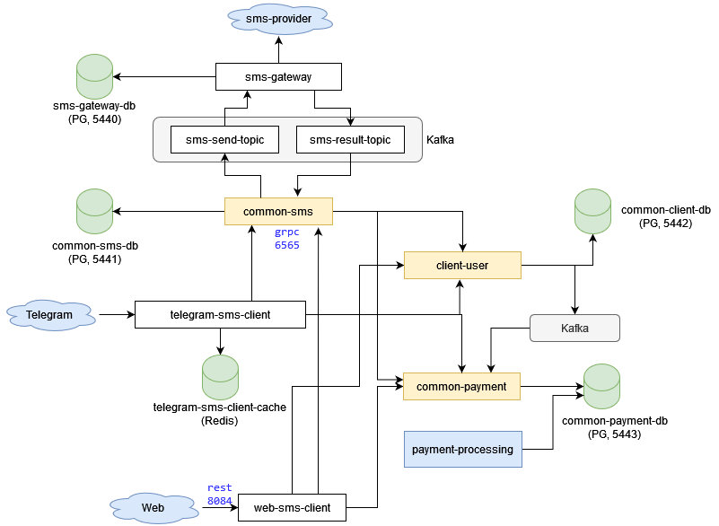

# SMS Gate Applications
### A several applications for sms-gate
It's the final project on a course "Java Professional Developer"

## Описание на русском
Система отправки SMS-сообщений с использованием разных клиентов (telegram, web-клиенты) на платной основе.

### Функционал
* регистрация клиента
* деактивация клиента
* пополнение счета
* список платежей
* отправка sms
* список sms

### Список микросервисов
* telegram-sms-client - rest-сервис для взаимодействия с telegram.
* web-sms-client - универсальный rest-сервис для взаимодействия с web-клиентами.

* common-sms - общий сервис для работы с sms.
* sms-gateway - сервис, взаимодействующий с sms-провайдером, предоставляющим услуги по рассылке SMS.

* common-user - сервис для работы с пользователями
* common-payment - сервис для работы с балансами/платежами и т.д.

### Организация взаимодействие

Для хранения данных микросервисов используется СУБД PostgreSQL (персистентное хранилище).  
Для хранения данных по взаимодействию с пользователями Telegram (текущий шаг меню и т.п.) используется key-value СУБД Redis (теоретически данные не критичны, важна скорость работы).  
Для синхронного межсервисного взаимодействия используется gRPC(protobuf).  
Для асинхронного межсервисного взаимодействия используется Kafka.  

### Используемые технологии 
Java 17, Gradle, Spring (data-jpa, mvc, kafka), PostgreSQL, Redis, gRPC(protobuf), Kafka, Rest, JUnit5

### Диаграмма

---
Author: Kivilev Denis  
I'm a Backend Developer (Java/Kotlin/Oracle).  
I'm looking for a new job opportunities. If u have one plz let me know.

Telegram: https://t.me/kivilev  
Linked-in: https://www.linkedin.com/in/kivilev/  
Email: kivilev.d@gmail.com  

---
